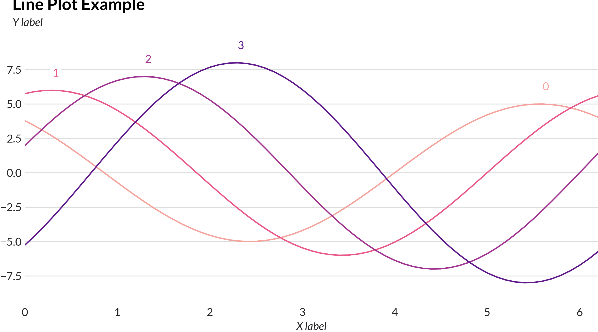
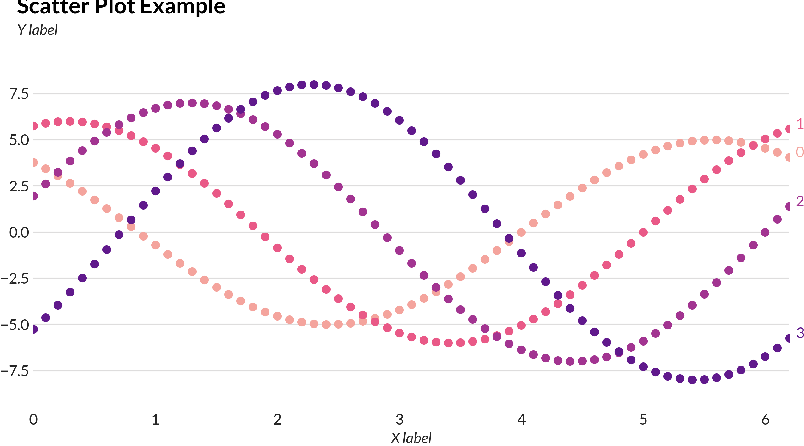
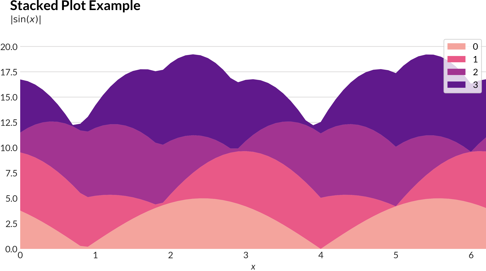
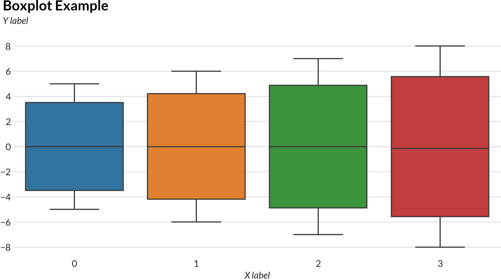
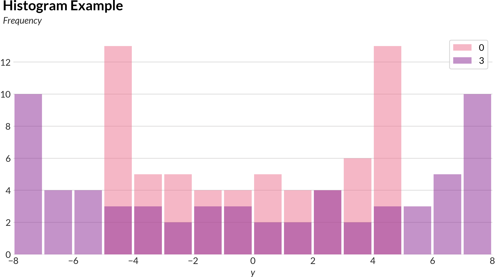
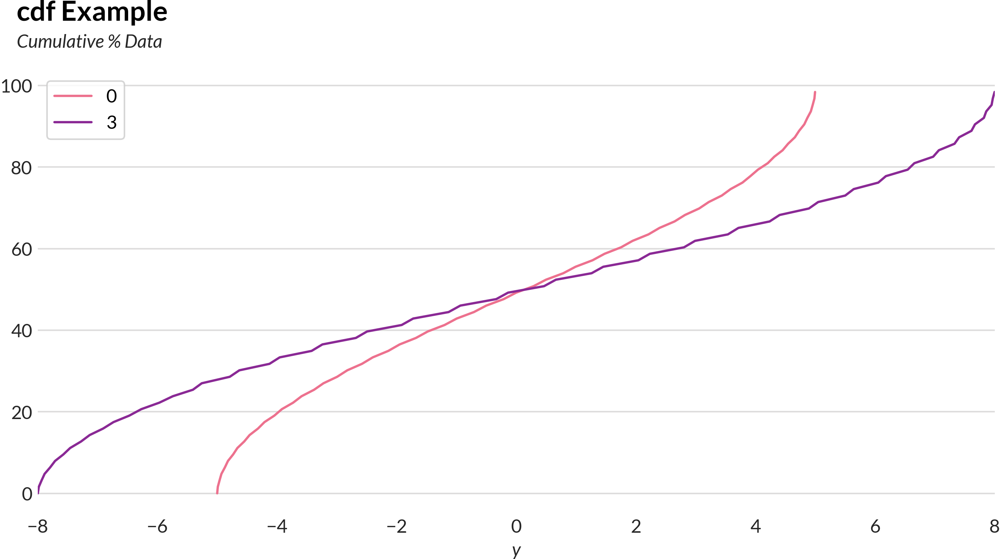
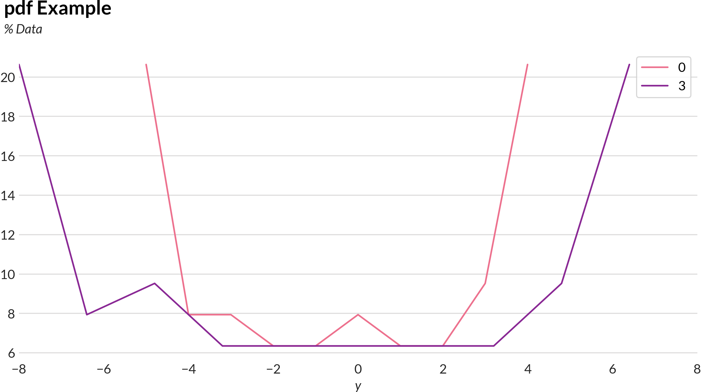

# Plorts - Niceish python plots

[](https://plorts.readthedocs.io/en/latest/?badge=latest)


A thin wrapper around matplotlib that handles a lot of common plots I need to make.

```
$ pip install plorts
```

## Examples

For the code to make these examples, see [Sample.ipynb](https://github.com/brucespang/plorts/blob/master/Sample.ipynb)








