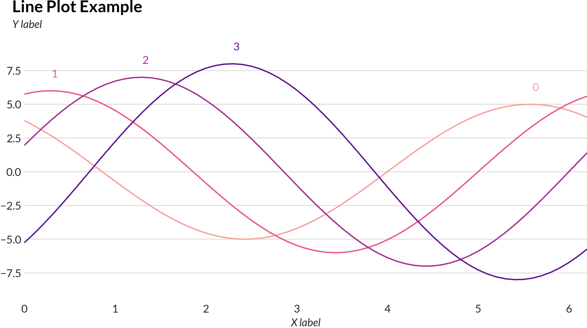
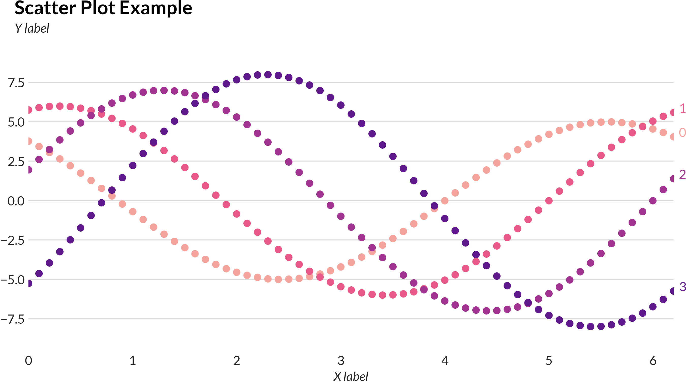

# Plorts - Niceish python plots

Like seaborn but with less stuff and also it starts faster

```
$ pip install plorts
```

## Examples

For source code, see [Sample.ipynb](https://github.com/brucespang/plorts/blob/master/Sample.ipynb)





